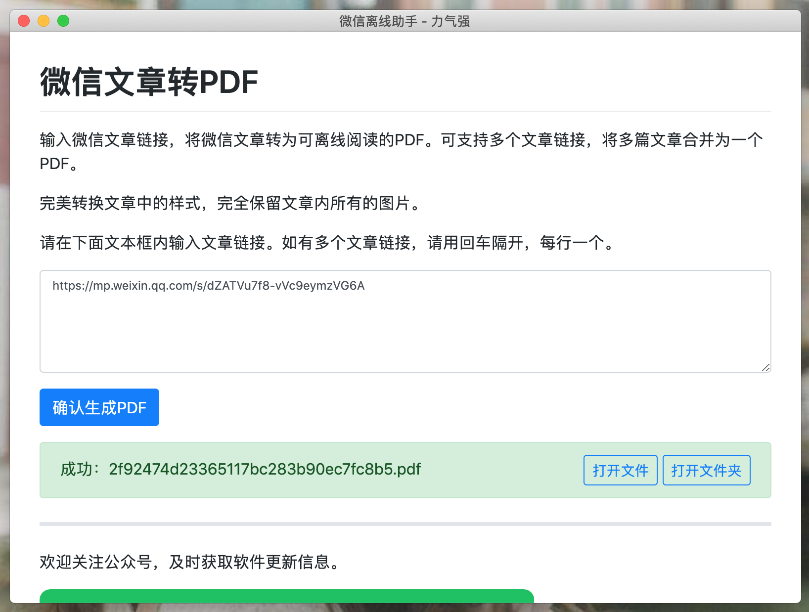
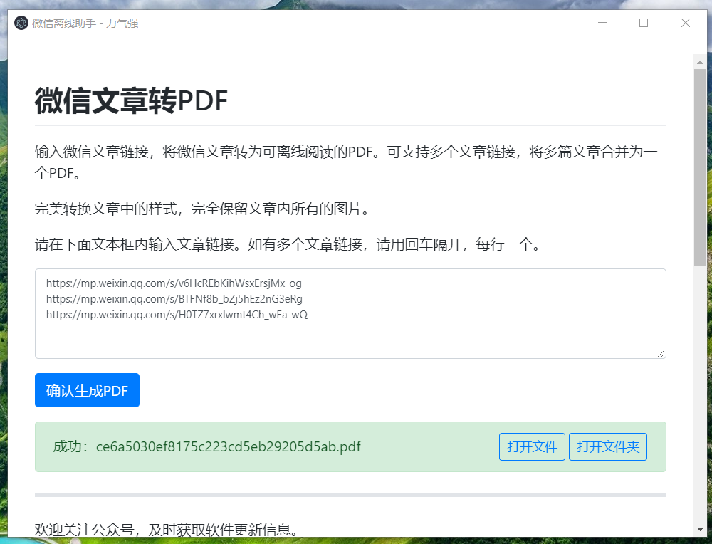
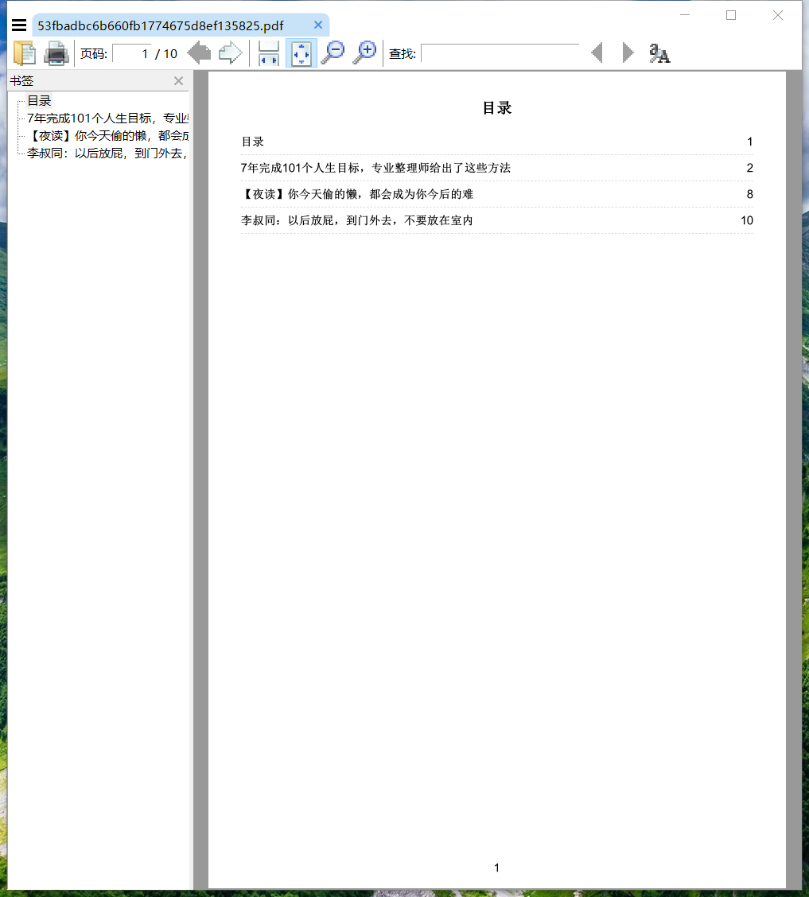
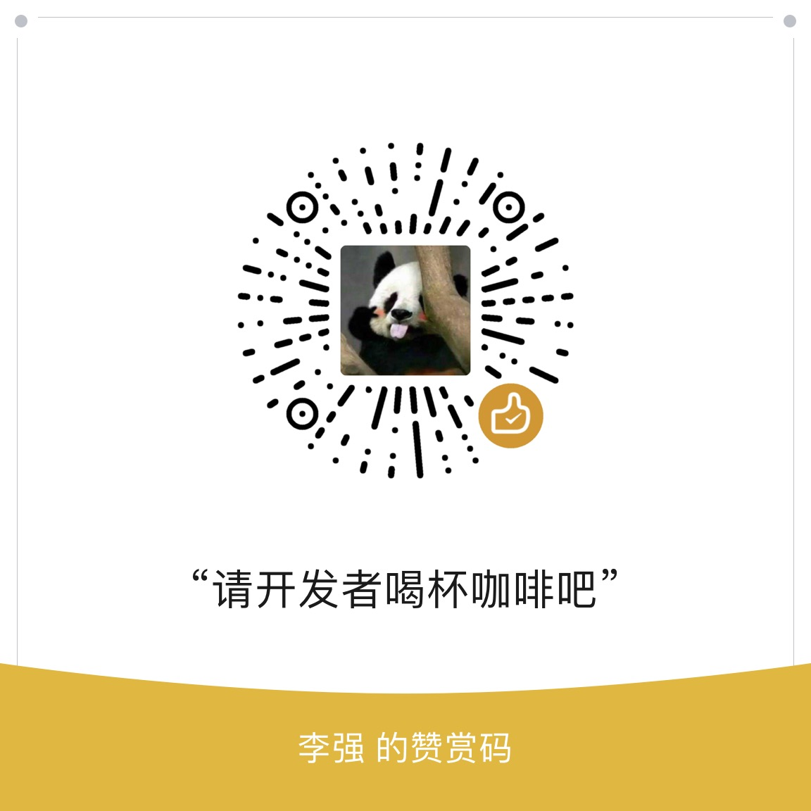

# 力气强微信离线助手

### 介绍

微信文章转 PDF 桌面工具，Windows 和 Mac 都可使用。

界面基于 [electron](https://www.electronjs.org/) 开发，PDF 库引用 [wkhtmltopdf](https://github.com/wkhtmltopdf/wkhtmltopdf)。

### 功能特点

- 完美保留微信文章中的图片和样式排版
- 自定义合并多条文章为一个 PDF，且生成的 PDF 包含目录和书签
- 界面交互简单

### 下载使用

百度云：[https://pan.baidu.com/s/11SBnKeLykTd8IiHpL6AE-g](https://pan.baidu.com/s/11SBnKeLykTd8IiHpL6AE-g) 密码：`5a8t`

下载属于自己操作系统的压缩包，解压，Windows 系统打开 `electron.exe`，Mac 系统打开 `Electron.app`，即可使用。

### 功能截图

### 联系作者及赞赏

